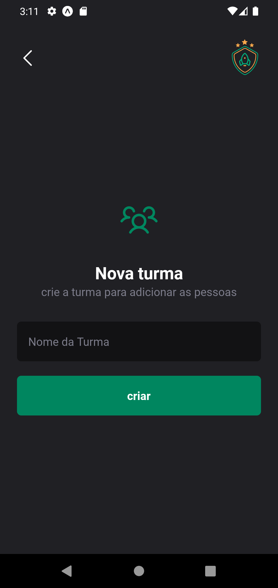

# Ignite Teams - React Native (Rocketseat)

Este é o **Projeto 2** da trilha de React Native da plataforma **Rocketseat**.

## 🚀 Criando o Projeto
Para criar este projeto, foi utilizado o seguinte comando:
```sh
npx create-expo-app igniteteams --template
```

## 📦 Instalação das Dependências
Antes de executar o projeto, instale as dependências com:
```sh
npm install
```

## ▶️ Executando o Projeto
Para iniciar a aplicação, utilize o comando:
```sh
npx expo start
```

## 📸 **Pré-visualização do App**

Confira abaixo algumas capturas de tela do aplicativo em funcionamento:

<p align="center">
  
  
</p>
<p align="center">
  
  
</p>

## 🚀 Tecnologias e conceitos aplicados

Este projeto utiliza diversas tecnologias e conceitos fundamentais no desenvolvimento com React Native:

- **Expo** → Framework para facilitar o desenvolvimento de apps React Native
- **Styled-Components** → Estilização com CSS-in-JS
- **React Navigation** → Gerenciamento de navegação entre telas
- **Async Storage** → Armazenamento local no dispositivo
- **Phosphor Icons** → Biblioteca de ícones para UI
- **Google Fonts** → Uso de fontes personalizadas da Google
- **Babel Module Resolver** → Simplificação de caminhos de importação

## 🛠 Recursos e Bibliotecas Utilizadas
A seguir, uma lista das bibliotecas e recursos adicionados ao projeto, com links para a documentação oficial:

### 1️⃣ [babel-plugin-module-resolver](https://github.com/tleunen/babel-plugin-module-resolver/tree/master)
- Facilita importações utilizando caminhos absolutos.
- Instalação:
  ```sh
  npm install --save-dev babel-plugin-module-resolver
  ```
- Configurado em:
  - [`babel.config.js`](./babel.config.js)
  - [`tsconfig.json`](./tsconfig.json)
- 📅 **Adicionado em:** 21/02/2025.

### 2️⃣ [styled-components](https://styled-components.com/docs)
- Permite utilizar CSS-in-JS para estilização.
- Instalação:
  ```sh
  npm install styled-components
  ```
- Para evitar incompatibilidades, foi necessário rodar:
  ```sh
  npm install react@18.2.0 react-dom@18.2.0
  npm install @types/styled-components --save-dev
  ```
- Declaração de tipos: [`styled-components.d.ts`](./src/styled-components.d.ts)
- 📅 **Adicionado em:** 21/02/2025.

### 3️⃣ [expo-google-fonts](https://docs.expo.dev/develop/user-interface/fonts/)
- Utilização de fontes personalizadas do Google (Roboto).
- Instalação:
  ```sh
  npx expo install expo-font @expo-google-fonts/roboto
  ```
- 📅 **Adicionado em:** 24/02/2025.

### 4️⃣ [phosphor-react-native](https://github.com/duongdev/phosphor-react-native)
- Biblioteca de ícones para React Native.
- Instalação:
  ```sh
  npm install --save phosphor-react-native
  npx expo install react-native-svg
  ```
- Ícones disponíveis no [site oficial](https://phosphoricons.com).
- 📅 **Adicionado em:** 24/02/2025.

### 5️⃣ [react-navigation](https://reactnavigation.org/docs/getting-started)
- Implementação da navegação no aplicativo.
- Instalação:
  ```sh
  npm install @react-navigation/native
  ```
- Dependências adicionais:
  ```sh
  npx expo install react-native-screens react-native-safe-area-context
  ```
- Estratégia de navegação Stack:
  ```sh
  npm install @react-navigation/native-stack
  ```
- 📅 **Adicionado em:** 28/02/2025.

### 6️⃣ [async-storage](https://docs.expo.dev/versions/latest/sdk/async-storage/)
- Armazena dados localmente no dispositivo.
- Instalação:
  ```sh
  npx expo install @react-native-async-storage/async-storage
  ```
- 📅 **Adicionado em:** 28/02/2025.

## 📌 Observações
- Caso encontre problemas ao instalar as dependências, tente remover a pasta `node_modules` e o arquivo `package-lock.json`, e reinstale com:
  ```sh
  rm -rf node_modules package-lock.json
  npm install
  ```

## 📜 Licença
Este projeto é desenvolvido para fins educacionais seguindo a trilha **Ignite** da **Rocketseat**. 🚀

Feito com ❤️ por Cesar August

